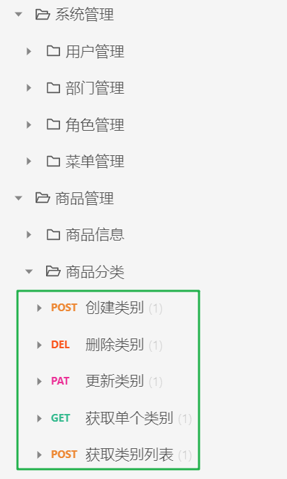
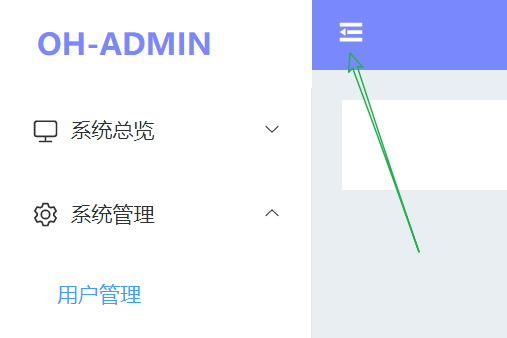

# vue3-js-admin

一个 Vue3 + Element Plus 后台管理系统。

## 项目初始化及代码规范配置

初始化：`Vue3 + Vuex + Router + Less + Prettier + Eslint`；(后面将 `Vuex` 替换为了 `Pinia`)

代码格式、提交规范：EditorConfig 为不同编辑器维护一致的代码风格，`Prettier + Eslint + husky + commitizen` 保证代码符合 eslint 规范 和 git commit 规范。

## 组件库安装和工具封装

### CSS reset

安装 `normalize.css`：`yarn add normalize.css`；

在 `src/main.js` 中引入：`import 'normalize.css'`。

### Element Plus 按需导入

安装 `element-plus`：`yarn add element-plus`；

按需导入所用到的额外的插件：`yarn add -D unplugin-vue-components unplugin-auto-import`；

之后在 `vue.config.js` 中写入：

```js
const AutoImport = require('unplugin-auto-import/webpack')
const Components = require('unplugin-vue-components/webpack')
const { ElementPlusResolver } = require('unplugin-vue-components/resolvers')
module.exports = {
  configureWebpack: {
    plugins: [
      AutoImport({
        resolvers: [ElementPlusResolver()]
      }),
      Components({
        resolvers: [ElementPlusResolver()]
      })
    ]
  }
}
```

在 `src/App.vue` 的 `template` 中使用 `<el-button type="primary">element plus is ok!</el-button>` 查看使用情况，可以发现页面按钮正常显示，安装完成。

### axios 库二次封装、区分不同环境及跨域设置

1.区分不同环境：

> [vue cli 模式和环境变量](https://cli.vuejs.org/zh/guide/mode-and-env.html#%E6%A8%A1%E5%BC%8F)：只有 `NODE_ENV`，`BASE_URL` 和以 `VUE_APP_` 开头的变量将通过 `webpack.DefinePlugin` 静态地嵌入到客户端侧的代码中。

`.env.development` 文件设置如下，让开发环境下能够请求对应的接口。

```js
# dev
VUE_APP_BASE_URL = 'http://152.136.185.210:5000'
VUE_APP_BASE_API = '/api'
```

2.跨域设置

`vue.config.js` 设置接口代理，如下：

```js
module.exports = {
  devServer: {
    proxy: {
      '/api': {
        target: process.env.VUE_APP_BASE_URL,
        changeOrigin: true,
        pathRewrite: {
          '^/api': ''
        }
      }
    }
  }
}
```

3.axios 库二次封装

见 `src/service`。

`src/service/request` 中创建请求类，`src/service/index` 中传入 config 创建请求实例。

```js
// axios(config) 相当于 axios.request(config)
axios({
  url: '/api/login',
  method: 'POST',
  data: {
    name: 'gull',
    password: '123456'
  }
})
axios.request({
  url: '/api/login',
  method: 'POST',
  data: {
    name: 'gull',
    password: '123456'
  }
})
```

### localStorage 二次封装

见 `src/utils/cache.js`。

将项目中所有数据存入一个大对象中。

## api 请求

一些接口的格式是相同的，为增删改查和获取列表，如下图所示：



我们对这两部分进行统一处理。见 `src/service/api/system.js`；

在 `src/service/api/login.js` 中处理登录、获取用户信息、获取角色菜单树。

## 登录页面和后台布局搭建

1.更新到 `Vue3.2`：`yarn add vue@3.2.26 vue-router@4.0.11 vuex@4.0.2`、`yarn add @vue/compiler-sfc -D`；卸载 `Vuex`，安装 Pinia `yarn add pinia`。

2.使用 `el-form` 和表单校验实现登录页面。见 `src/views/login`。

3.后台布局，见 `src/views/main.main.vue`，使用的是 element plus 的布局容器。

4.`el-dropdown` + `el-avatar` 实现 `nav-header` 右侧的用户头像及下拉菜单。

`el-avatar` 头像使用本地图片示例：

```html
<el-avatar class="avatar" :src="require('@/assets/img/avatar.svg')"></el-avatar>
```

## 侧边折叠菜单栏与路由-页面配置

1.`pinia` 管理 user 信息：

登录页面点击登录按钮时，要实现登录、获取用户信息、获取角色菜单，这三个操作都放在同一个登录函数中，见 [./src/store/user.js](./src/store/user.js)：使用 `pinia` 存储用户登录时的 `token`，通过登录时获得的 `id` 查找对应的用户信息，再根据用户信息的 `role id` 查找对应的角色菜单树，得到 `userMenus`，最后跳转到首页。

2.`element-plus@1.2.0` 的 `icon` 图标使用：

安装 `yarn add @element-plus/icons-vue`；按需引入和注册组件示例如下：

```js
import { Monitor } from '@element-plus/icons-vue'
export default {
  components: {
    Monitor
  }
}
```

3.点击折叠图标实现展开菜单栏

`nav-header` 中设置 `isFold` 来控制图标是 `Fold` 还是 `Expand`，并通过 `setup(props, { emit })` 来触发 `foldChange` 事件，同时传参 `isFold.value`，并将 `isFold.value` 取反。父组件 `main.vue` 监听到 `foldChange` 事件后将 `isCollapse` 设置为传过来的 `isFold.value`。



4.配置路由文件及对应的页面，见 `src/router` 及 `src/views/main` 两个目录。

使用 `route.path` 来作为 `el-menu` 的 `default-active`，即当前激活菜单项。

## el-form 和 el-table 制作信息列表页面

1.`page-search` 和 `page-content` 组件。

2.分页器

> `watchEffect`：立即执行传入的一个函数，同时响应式追踪其依赖，并在其依赖变更时重新运行该函数。

用 `watchEffect` 来传入 `pinia` 中获取表格数据的函数，使用 `v-model:pageSize="pageSize"` 和 `v-model:currentPage="currentPage"` 将页面表格行数量和当前页进行双向绑定，当他们发生改变时，`watchEffect` 中的函数重新运行，获取新数据，数据存在 `src/store/system.js`，即 `useSystemStore` 中。
`offset` 为`offset: (currentPage.value - 1) * pageSize.value,`！
使用 `computed` 来得到存储的最新表格数据。

3.封装 `form` 组件，利于 `page-search` 和新建、编辑时的弹出框的共同使用。

## 其他

造了很多 bug，也改了很多 bug。完成搜索、重置、新建、删除功能。点击重置按钮后，重新进行搜索会有问题，将清空后的表单数据返回到父组件就行了。
